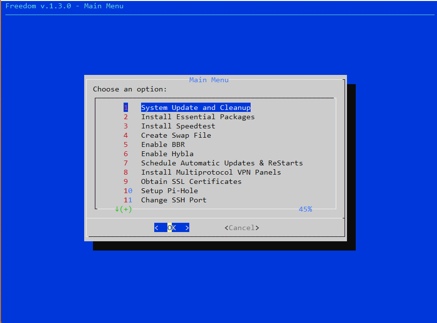

<div align="center">

</div>


# FREEDOM
 A Simple Bash Script With TUI For Setting Up Ubuntu Server

لطفا تمامی اسکریپت ها را روی یک سرور اجرا نکنید ...

 
What does this script do? you can select to:
1. Update & Cleanup Server 
2. Install Essential Packages 
3. Install Speedtest 
4. Create SWAP File 
5. Enable BBR 
6. Enable Hybla 
7. Schedule Automatic Updates & Restarts at 01:00 GMT+3:30 
8. Install Multiprotocol VPN Panels (Alireza/MHSanaei/Reality-EZPZ/vaxilu/FranzKafkaYu) 
9. Obtain SSL Certificates 
10. Install Pi-Hole network-wide Adblocker 
11. Change SSH Port 
12. Enable UFW 
13. Install & Configure WARP Proxy 
14. Install Erlang MTProto Proxy 
15. Setup Hysteria II 
16. Setup TUIC v5 
17. Setup Juicity 
18. Setup WireGuard 
19. Setup OpenVPN 
20. Setup IKEv2/IPsec 
21. Setup Reverse TLS Tunnel 
22. Create non-root SSH User 

⚠️ Manually set the parameters yourself when prompted during the setup.

⚠️ در هنگام راه‌اندازی، وقتی درخواست برای تنظیم پارامترها نمایش داده می‌شود، پارامترها را به صورت دستی وارد کنید.
## How to run 
It's highly recommended to run this script only on a fresh install of Ubuntu 22.04.
```
curl -O https://raw.githubusercontent.com/ipmartnetwork/FreeDom/main/Freedom.sh && chmod +x Freedom.sh && sed -i -e 's/\r$//' Freedom.sh && sudo apt update && sudo apt install -y dialog && ./Freedom.sh
```
برای اجرای مجدد اسکریپت 

```
./Freedom.sh
```
## Access Panels 
1. If you have installed Reality-EZPZ, you can access its TUI by running the following command:
```
bash <(curl -sL https://bit.ly/realityez) -m
```
2. If you have installed X-UI Panels, you can access their command-line interface by using the following command:
```
x-ui
```
3. If you have installed Pi-hole, you can access its command-line interface by using the following command:
```
pihole
```
##  After setup has completed, don't forget to:

1. Add your desired adlists via Pi-hole web interface
```
https://raw.githubusercontent.com/StevenBlack/hosts/master/hosts
https://raw.githubusercontent.com/d3ward/toolz/master/src/d3host.txt
https://big.oisd.nl/
https://raw.githubusercontent.com/hagezi/dns-blocklists/main/domains/pro.txt
https://blocklistproject.github.io/Lists/abuse.txt
https://blocklistproject.github.io/Lists/ads.txt
https://blocklistproject.github.io/Lists/crypto.txt
https://blocklistproject.github.io/Lists/drugs.txt
https://blocklistproject.github.io/Lists/fraud.txt
https://blocklistproject.github.io/Lists/gambling.txt
https://blocklistproject.github.io/Lists/malware.txt
https://blocklistproject.github.io/Lists/phishing.txt
https://blocklistproject.github.io/Lists/ransomware.txt
https://blocklistproject.github.io/Lists/redirect.txt
https://blocklistproject.github.io/Lists/scam.txt
https://raw.githubusercontent.com/MasterKia/PersianBlocker/main/PersianBlockerHosts.txt
```
2. Update Pi-hole Database
```
pihole -g
```
3. Modify Lighttpd

⭕ If you have installed Pi-hole/reality-ezpz, then Lighttpd/docker is listening on port 80 by default. If you haven't changed the Lighttpd port, it's necessary to stop it before obtaining SSL certificates. Below, you can find commands to start, stop, restart, and modify the configuration of Lighttpd.

⭕ اگر شما Pi-hole یا reality-ezpz را نصب کرده‌اید، در این صورت Lighttpd/docker به صورت پیش‌فرض از پورت 80 استفاده می‌کند. اگر پورت Lighttpd را تغییر نداده‌اید، قبل از دریافت گواهی SSL، لازم است آن را متوقف کنید. در زیر، شما می‌توانید دستوراتی برای شروع، توقف، بازآغاز و تغییر پیکربندی Lighttpd پیدا کنید.
```
sudo nano /etc/lighttpd/lighttpd.conf
```
```
sudo systemctl start lighttpd.service
sudo systemctl stop lighttpd.service
sudo systemctl restart lighttpd.service
```
4. Obtain SSL Certificates 
```
sudo certbot certonly --standalone --preferred-challenges http --agree-tos --email yourmail@gmail.com -d sub.domain.com
```
5. Change SSH Port
```
sudo nano /etc/ssh/sshd_config
sudo systemctl reload sshd
```
6. Setup UFW
```
sudo nano /etc/default/ufw
sudo ufw default deny incoming
sudo ufw default allow outgoing
sudo ufw allow SSHPORT/tcp
sudo ufw limit SSHPORT/tcp
sudo ufw allow PORT
sudo ufw enable
sudo ufw status verbose
sudo systemctl enable ufw
```
7. Change WARP License Key
```
warp-cli set-license <your-warp-plus-license-key>
```
8. WARP Status
```
bash <(curl -fsSL git.io/warp.sh) status
```
9. Change Server DNS to use Pi-hole
```
sudo nano /etc/resolv.conf
nameserver 127.0.0.53
```
If /resolv.conf managed by systemd-resolved, then you have to follow these steps:
```
cd /etc/netplan/
ls
nano ab-cloud-init.yaml
sudo netplan apply
```
You need to add the following lines to the 'ab-cloud-init.yaml' file:
```
nameservers:
  addresses: [127.0.0.53]
```
10. Restart your server with
```
sudo shutdown -r now
```
## Optional: Install qbittorrent-nox 
```
sudo add-apt-repository ppa:qbittorrent-team/qbittorrent-stable
sudo apt update
sudo apt install qbittorrent-nox
sudo nano /etc/systemd/system/qbittorrent-nox.service
qbittorrent-nox
sudo adduser --system --group qbittorrent-nox
sudo adduser root qbittorrent-nox
sudo systemctl daemon-reload
sudo systemctl enable qbittorrent-nox
sudo systemctl start qbittorrent-nox
sudo systemctl status qbittorrent-nox
```
### qbittorrent-nox.service configuration
```
[Unit]
Description=qBittorrent-nox
After=network.target

[Service]
Type=forking
ExecStart=/usr/bin/qbittorrent-nox -d --webui-port=8000
Restart=on-failure

[Install]
WantedBy=multi-user.target
```
## Optional: Install AriaFileServer 

```
cd /home/qbittorrent-nox/Downloads
wget https://raw.githubusercontent.com/ErfanNamira/AriaFileServer/main/AriaFileServerHTTP.py
sudo apt install python3-pip
pip3 install flask passlib
python3 AriaFileServerHTTP.py
```
## Optional: Install simplefileserver 

⚠️ simplefileserver DO NOT Support Authentication
```
cd /home/qbittorrent-nox/Downloads
wget https://github.com/sssvip/simple-file-server/releases/download/v0.1.4/simple-file-server_0.1.4_linux_amd64.tar.gz
tar -xzvf simple-file-server_0.1.4_linux_amd64.tar.gz
chmod 777 simplefileserver
sudo /home/qbittorrent-nox/Downloads/simplefileserver 80
```
## Optional: WARP XrayConfig 
```
{
  "protocol": "socks",
  "settings": {
    "servers": [
      { 
        "address": "127.0.0.1",
        "port":40000
      }
    ]
  },
  "tag":"warp"
},
```
## Join Our Telegram Channel 

[](https://t.me/ipmartpanel)

Join our Telegram channel for the latest updates, clean Cloudflare IPs, and free VPN configurations. Stay connected with our community!

## Used Projects 
```
https://github.com/pi-hole
https://github.com/vaxilu/x-ui
https://github.com/alireza0/x-ui
https://github.com/MHSanaei/3x-ui
https://github.com/Gozargah/Marzban
https://github.com/FranzKafkaYu/x-ui
https://github.com/aleskxyz/reality-ezpz
https://github.com/hiddify/Hiddify-Server
https://github.com/radkesvat/ReverseTlsTunnel
https://github.com/deathline94/Juicity-Installer
https://github.com/deathline94/tuic-v5-installer
https://github.com/deathline94/Hysteria-Installer
https://github.com/HirbodBehnam/MTProtoProxyInstaller
https://github.com/sssvip/simple-file-server
https://github.com/angristan/wireguard-install
https://github.com/angristan/openvpn-install
https://github.com/blocklistproject/Lists
https://github.com/hwdsl2/setup-ipsec-vpn
https://github.com/rahgozar94725/freedom
https://github.com/seriyps/mtproto_proxy
https://github.com/P3TERX/warp.sh
```

